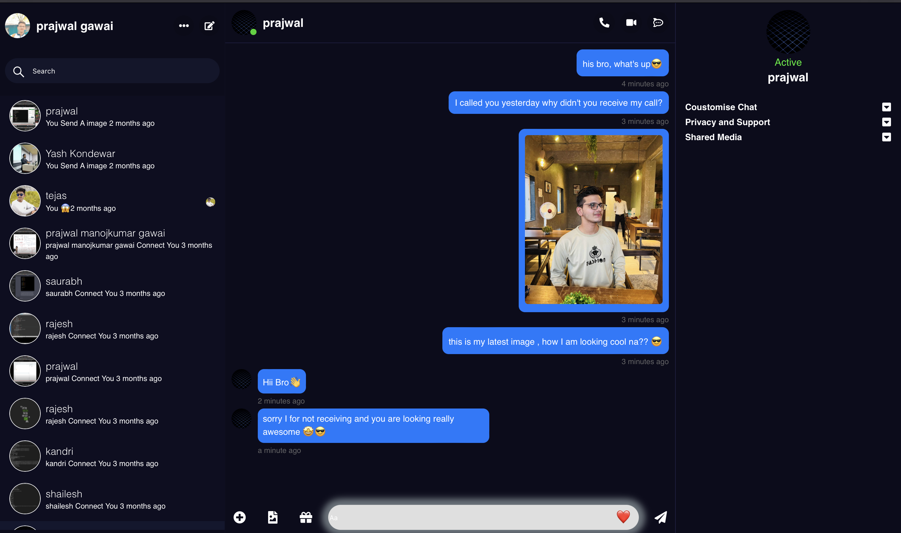
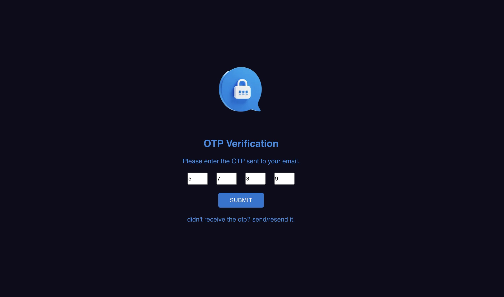
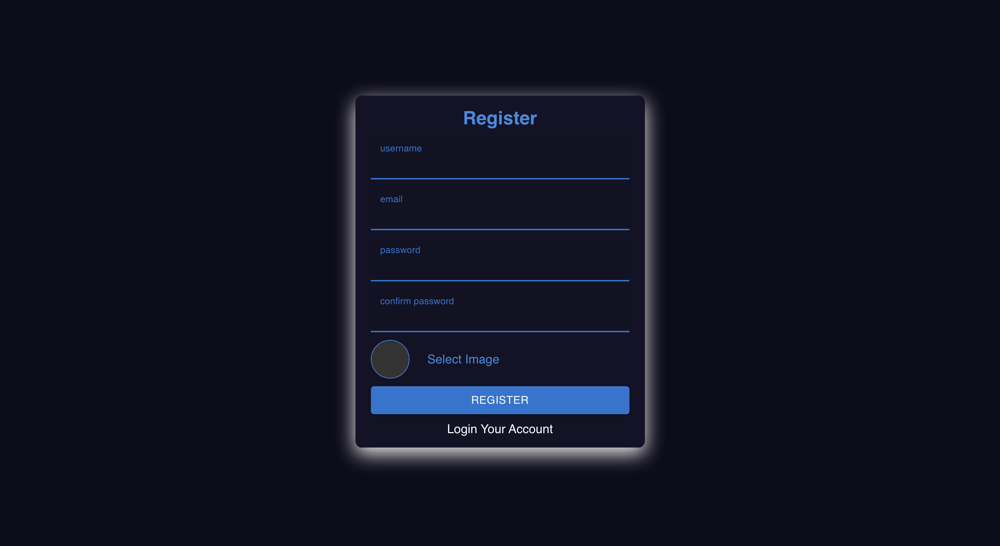

# Stack Overflow Clone

This app is simillar to facebook messenger which includes Real Time features like- Message, image sending, receiving, deleting, profile updating, Otp Verification, Secure Login, Registration using Jwt, Dark and Light Theme

## Technologies used:

- React js
- Node js
- Express js
- MongoDb
- Redux
- Socket.io
- Json web token and more

## How to use?

Fork and clone the repo and follow the below steps:

- Install Node.js
- Open the whole Folder in Vs Code or with Any other IDE
- Install Dependencies using the command

```
npm install
```

- Start App using the command

```
npm run dev
```

- Go to Socket folder and run following command

```
npm run socket
```

## Pics of the application





